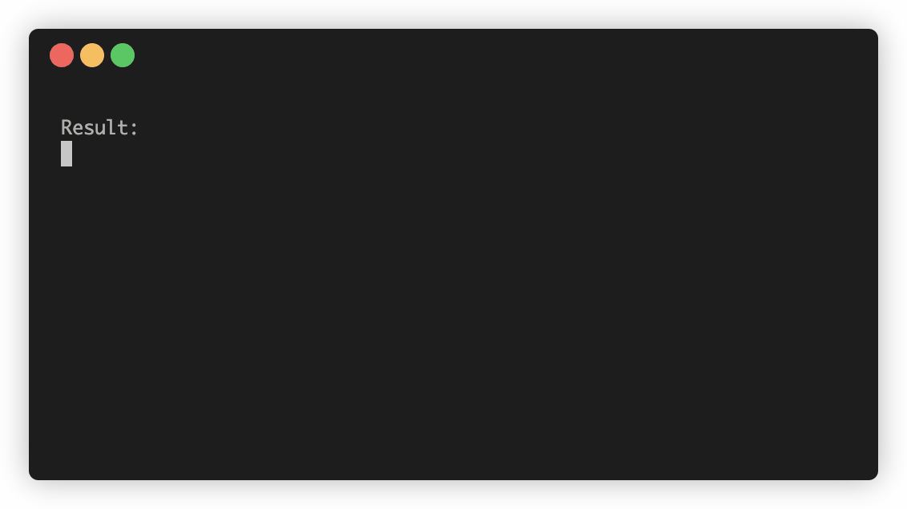

# interakt
Interactive prompts made easy!

## Usage


To construct and run an interactive prompt, you need to:
1. Obtain a `Prompt` instance
2. Add `PromptField`s to the prompt
3. Execute the prompt

Using a few convenience methods, we can achieve all this in just a few lines of code:
```kotlin
prompt {
    text("foo:", default = "default value")
    integer("bar:", default = 42)
    list("baz:", listOf("1", "2", "3"), true)

    println("Result:")
    for((key, value) in execute()) {
        println("${key.promptMessage} $value")
    }
}
```

## Fields

### `PromptField`
Base class for all other fields  

**Options:**  

| Parameter     | Type                                        | Description                                                                                                         |
|---------------|---------------------------------------------|---------------------------------------------------------------------------------------------------------------------|
| promptMessage | `String`                                    | Message to display before user input                                                                                |
| shouldPrompt  | `(PromptResult, PromptField<T>) -> Boolean` | Controls whether the field should be prompted. Receives the answers entered so far and the current field's instance |
| default       | `(PromptResult, PromptField<T>) -> T?`      | Provides a default value that will be pre-filled                                                                    |

### `TextField`
Prompts user for simple text input

### `IntegerField`
Prompts user for integer input

### `ListField`
Prompts the user to choose from a list of items. The displayed name and the actual value of the items may differ.

**Options:**

| Parameter | Type                                | Description                   |
|-----------|-------------------------------------|-------------------------------|
| choices   | `(PromptResult) -> List<Choice<T>>` | Returns the available choices |

### `TextListField`
Prompts the user to choose from a list of text items. Optionally the user may enter a custom value.

**Options:**

| Parameter           | Type                                         | Description                                                                                                     |
|---------------------|----------------------------------------------|-----------------------------------------------------------------------------------------------------------------|
| choices             | `(tr: PromptResult) -> List<Choice<String>>` | Returns the available choices                                                                                   |
| allowCustom         | `Boolean`                                    | Allow the user to enter a custom value. If `true` an additional choice will be added with an empty string value |
| customPromptMessage | `String`                                     | Message to display when user enter custom value                                                                 |

## Acknowledgement
interakt is built using [JLine](https://github.com/jline/jline3)